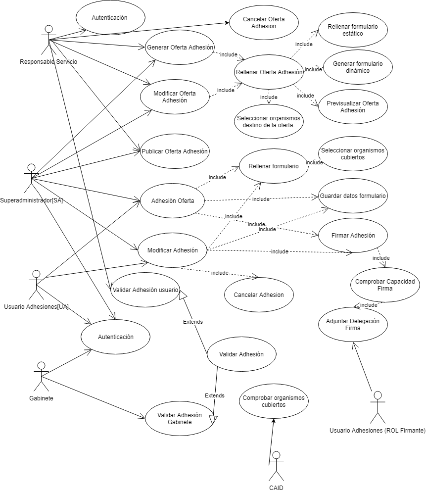
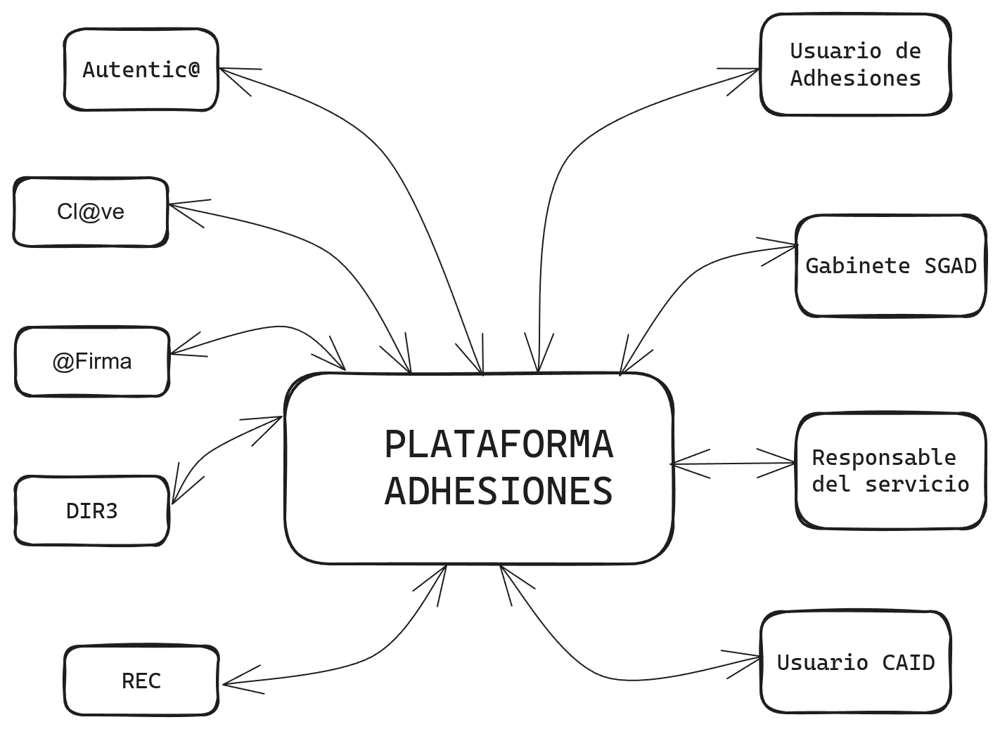
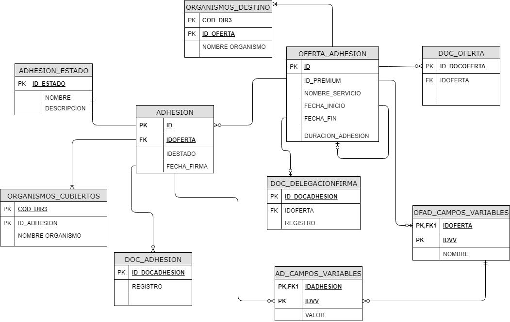
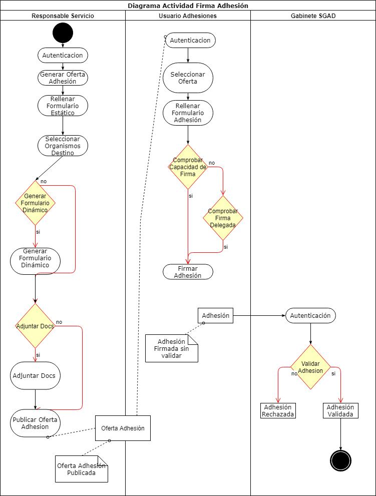

> [!NOTE|style: callout|label: Supuesto del INAP 2018]
> ## Supuesto 1: ADHESIONES <!-- {docsify-ignore} -->
> **Autor: Andrés García Cañizares**

### SOLUCIÓN

#### 1. Elabore el diagrama de casos de uso. Identificando los actores involucrados



#### 2. Realice el diagrama de contexto del aplicativo, identificando posibles sistemas externos y la funcionalidad que aportan en la solución aportada.



- **Autentica**: Servicio que provee los perfiles de usuarios, que permitirá gestionar los distintos perfiles que acceden al aplicativo y las funcionalidades que pueden realizar dentro del mismo.
- **@Firma**: Servicios de validación y firma electrónica multi-PKI @firma, como un servicio de validación de certificados y firmas electrónicas desacoplado de las aplicaciones. Permitirá que se pueda validar cualquier documento aportado.
- **DIR3**: El Directorio Común proporciona un Inventario unificado y común a toda la Administración de las unidades orgánicas / organismos públicos, sus oficinas asociadas y unidades de gestión económica - presupuestaria, facilitando el mantenimiento distribuido y corresponsable de la información. Permitirá la gestión de organismos, y las coberturas que dan las firmas de las Adhesiones.
- **Cl@ve**: Es la plataforma común de identificación y firma electrónica, permitirá la identificación de los usuarios a la hora de entrar en el aplicativo. Dentro de las distintas tipologías de identificación que permite clave, se utilizará el certificado electrónico, debido a la integridad necesaria en los datos.
- **REC**: Registro Electrónico Común de la AGE, se utilizará para registrar aquellos documentos que aporten los usuarios para realizar las delegaciones de firma en terceros.
- **Usuario de Adhesiones**: Personal de las AAPP que quieren realizar el proceso de adhesión a un servicio ofertado.
- **Gabinete SGAD**: Responsables de validar y confirmar que las adhesiones firmadas son correctas.
- **Responsable del Servicio**: Personal de las AAPP que ofertan el servicio al que adherirse y son responsables del mismo.
- **Usuario CAID**: Personal de ayuda a los integradores y desarrolladores. Deben comprobar antes de atender las solicitudes relativas a un servicio que existe una Adhesión validada y que el organismo está cubierto.

### 3. Enumere los distintos servicios, funcionalidades y herramientas de seguridad o relacionados que utilizaría en el aplicativo. Explique las funcionalidades que aportan cada uno.

- **Red Sara**: El aplicativo estaría desplegado dentro de la red Sara de las AAPP. Por un lado sería un aplicativo menos expuesto a ataques por no estar expuesto a internet y debido a los controles de seguridad de la red.
- **Uso de protocolo seguro https**: El aplicativo web cifrará las comunicaciones extremo a extremo con un certificado de servidor.
- **Cl@ve**: Servicio de identificación de usuarios. Mediante el aplicativo Cl@ve se independiza la gestión de la identificación, no teniendo que responsabilizarse el aplicativo y la gestión de la misma de este servicio.
- **REC**: Presentación en el registro, de los documentos que aportan los usuarios. Queda constancia con validez jurídica de la presentación de los documentos.
- **NAS**: Utilización de la NAS del ministerio. Aporta backups automáticos de los archivos correspondientes de cada adhesión.
- **@Firma**: Utilización del servicio de firma y validación para los documentos firmados.
- **Uso de certificados electrónicos**: Tanto para la identificación en el sistema, como para la firma de documentos.

#### 4. Diseñe diagrama Entidad - Relación de la solución aportada



#### 5. Realice el Diagrama de Actividad del proceso completo de una firma de Adhesión



#### 6. Responda razonadamente las siguientes cuestiones:

> a) Dado el diagrama Entidad Relación del apartado anterior, realice la query que ejecutaría sobre el modelo físico del diagrama anterior para obtener el histórico de adhesiones canceladas de un organismo para un mismo servicio ofertado.

```sql
SELECT A.* 
FROM ADHESION A, OFERTA_ADHESION O, ADHESION_ESTADO E
WHERE A.IDOFERTA = O.ID 
AND O.ID='IDSOOLOFERTADA' 
AND A.IDESTADO = E.ID 
AND E.NOMBRE='CANCELADA'
```
> b) Realice una breve descripción de las tecnologías y herramientas que usaría para la implementación del sistema.  

El desarrollo se podría realizar utilizando el lenguaje de programación PHP 7.1.3, sobre un servidor web Apache 2. El framework de desarrollo PHP sobre el que se desarrollará el aplicativo será Symphony 4. Para la realización del desarrollo sería recomendable el IDE PHPStorm por su integración con Symphony. La base de datos utilizada será MySQL 5.7 y como herramienta de diseño y consulta a la base de datos se utilizará MySQL Workbench.

> c) ¿Sería necesario el acceso al aplicativo vía internet? Justifique su respuesta.

La publicación de la solución web en internet no sería necesaria, debido a que la mayoría de organismos tienen conexión con la Red Sara, el servicio se publicaría en la misma, evitando así los posibles problemas de seguridad que pudieran ser ocasionados por tal exposición.

<a href="https://pmoreno-rodriguez.github.io/opos_gsi/#/supuestos/inap/indice.md" role="button" class="button">Volver al índice de Supuestos del INAP</a>

