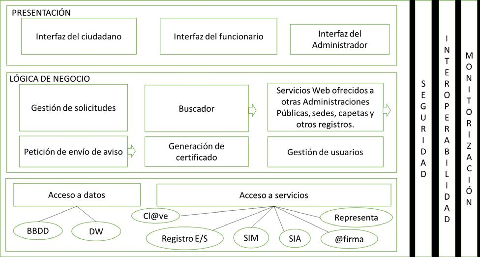

## Ejemplo de como explicar una Arquitectura Lógica  <!-- {docsify-ignore} -->

> [!NOTE|style:callout|label: Nota Aclaratoria]
> El texto y la imagen de este artículo están extraidos del supuesto del INAP adjunto.
> La intención es tener una idea básica de cómo explicar el diagrama de Arquitectura Lógica.

!> [Enlace al supuesto](https://pmoreno-rodriguez.github.io/opos_gsi/supuestos/inap/B3C2SOLUCION-M-ANGELES-GONZALO.pdf)

## Capa de Presentación :class=titulo-color <!-- {docsify-ignore} -->

### Interfaz del ciudadano

- El ciudadano o entidad que se vaya a relacionar con la Administración accederá a través de cualquier sede electrónica o carpeta ciudadana.
  - Los métodos de autenticación utilizados serán los solicitados en dicha sede, siempre teniendo en cuenta que se requerirá un nivel sustancial de autenticación. Si la sede está integrada con cl@ve, se utilizará cl@ve con nivel sustancial (N3), es decir, certificado software, cl@ve PIN o cl@ve permanente con envío de SMS.
  - Al ciudadano se le presentará un formulario para la realización de la tarea deseada: alta, baja, consulta o modificación.

### Interfaz del funcionario

- El funcionario se autenticará a través de AUTENTIC@.
  - El funcionario habilitado podrá realizar las acciones como si fuese el ciudadano.

### Interfaz del Administrador

- El Administrador también se autenticará a través de AUTENTIC@.

## Capa de Lógica de Negocio :class=titulo-color <!-- {docsify-ignore} -->

### Gestión de solicitudes

- Una vez realizada la presentación del formulario al ciudadano, el ciudadano lo rellenará y deberá firmarlo con un certificado electrónico reconocido X.509 v3, de los admitidos por las Administraciones Públicas (en un futuro se estudiará la posibilidad de realizar la firma utilizando firma básica), para comprobar la firma se utilizará @firma.
- Se dará también la posibilidad de utilizar firma en la nube.
- Una vez firmada la solicitud se almacenarán los datos.
- Se entregará el justificante de registro y se generará el expediente correspondiente.

### Buscador

- Se ofrecerá un servicio web de búsqueda para que se informe de donde aparece el número de teléfono o correo electrónico del ciudadano en el registro.

### Servicios Web ofrecidos a otras administraciones públicas, sedes y carpetas

- Se ofrecen los servicios web de alta, baja, consulta y modificaciones a las aplicaciones, sedes y carpetas de otras administraciones. Así como los servicios web necesarios para tener sincronizados los datos con otros registros. Las transmisiones de datos se realizarán en XML siguiendo siempre el formato de intercambio de datos que se habrá acordado previamente, se implementará un esquema XSD. Los servicios web se describirán mediante WSDL. Las transmisiones mediante servicios web se enviarán utilizando el protocolo SOAP sobre https. Además, a nivel de mensaje se firmará con WS-Security para garantizar su integridad.
- Estos servicios se ofrecerán a través de la plataforma de intermediación.

### Petición de envío de aviso

- Recibe las peticiones de envío de aviso, ya sean correo electrónico, SMS, notificaciones PUSH, etc. Contacta con el servicio Web de la plataforma de mensajería SIM para el envío correspondiente.

### Generación de certificados

- Se recibirán las solicitudes de certificado, se consulta la BD y se compone el certificado en formato PDF descargable. Se adjuntará un CSV para comprobar su integridad e irá firmado mediante sello electrónico del Ministerio.

### Gestión de usuarios

- Actualmente AUTENTIC@ proporciona identificación pero no autorización a las aplicaciones. La autorización de los funcionarios se realizará en este módulo.

## Capa de Acceso a datos y servicios :class=titulo-color <!-- {docsify-ignore} -->

### En la capa de acceso a datos se encuentra:

- La base de datos relacional donde se almacenarán los datos necesarios para el funcionamiento de la aplicación.
- El data warehouse donde se almacenarán los datos a tratar por el cuadro de mandos.

### En acceso a servicios se encuentran los servicios compartidos:

- Cl@ve (utilizados por algunas de las sedes electrónicas),
- REC (el registro electrónico de E/S común para los asientos registrales),
- SIM (plataforma de mensajería para el envío de avisos),
- SIA (para la consulta de procedimientos),
- @firma (para la firma de solicitudes, utilizado también en las sedes) y
- REPRESENTA (para la consulta de representantes y habilitados).
