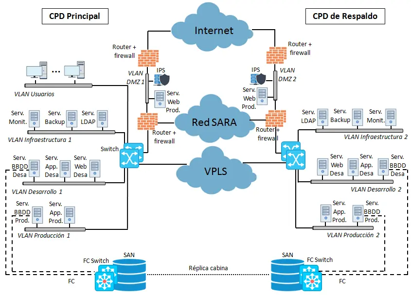

## Solución tecnológica para interconectar el CPD principal con uno de respaldo <!-- {docsify-ignore} -->

> [!NOTE|style:callout|label:Contenido del INAP]
> Contenido extraído de supuestos prácticos de cursos de formación del INAP para preparación de oposiciones

Para implementar una solución a largo plazo que interconecte el CPD principal con un CPD de respaldo, la idea es lograr que ambos centros operen como si fueran una única red, lo que se conoce como **CPD Extendido**. Esto implica desplegar una WAN que conecte las LANs de cada centro de forma transparente y que mantenga el mismo direccionamiento IP. Para ello, tecnologías como **MPLS (MultiProtocol Label Switching)** o **VPLS (Virtual Private LAN Service)** pueden ser utilizadas. Aunque MPLS ofrece la posibilidad de conectar varias sedes y gestionar eficientemente tráfico mixto como voz, vídeo y datos, **VPLS** es más segura y ofrece un mejor rendimiento para interconectar un número reducido de sedes, como en este caso, donde se maneja principalmente tráfico de datos.

### Conexión física <!-- {docsify-ignore} -->

En el aspecto físico, el CPD de respaldo debe estar situado en un entorno cercano al CPD principal, a una distancia no mayor de 10 km. Esto permite utilizar **fibra oscura** para conectar ambos centros, lo que asegura alta velocidad y baja latencia. Además, es importante utilizar múltiples enlaces **DWDM (Dense Wavelength Division Multiplexing)** para evitar puntos únicos de fallo (SPOF) y garantizar la tolerancia a fallos. Una opción eficiente sería agregar dos enlaces de 10 Gbps, que sumen una tasa total de 20 Gbps, lo cual es suficiente para gestionar la sincronización de datos entre ambos CPDs.

### Conexión lógica <!-- {docsify-ignore} -->

A nivel lógico, la interconexión de los CPDs se realizaría desde el core de la red interna, conectando los switches del CPD principal a los del CPD de respaldo. Lo ideal es emplear una topología en malla que garantice alta disponibilidad y redundancia en caso de fallos.

### Optimización de recursos <!-- {docsify-ignore} -->

Dado que disponer de un CPD de respaldo no implica duplicar todos los servidores del CPD principal y mantenerlos en espera, una solución más eficiente es distribuir las **máquinas virtuales secundarias** entre los dos CPDs. De esta manera, tendríamos un **cluster geográficamente disperso**, manteniendo la alta disponibilidad sin duplicar la infraestructura. En caso de fallos parciales, los servicios se transferirían automáticamente al CPD de respaldo, evitando interrupciones y simplificando la gestión.

### Gestión de datos <!-- {docsify-ignore} -->

Para mantener la continuidad operativa en caso de una contingencia total en el CPD principal, a nivel de datos es recomendable implementar una solución de **copia síncrona de cabina**, como **TrueCopy** o **PPRC (Peer-to-Peer Remote Copy)**. Esto permite que los datos se mantengan actualizados casi en tiempo real en la **SAN** del CPD de respaldo, asegurando la integridad y disponibilidad de los datos en caso de fallo total en el CPD principal.

Asimismo, es fundamental que los datos almacenados localmente en cada servidor estén sincronizados con sus réplicas en el CPD de respaldo. Para lograr esto, se pueden utilizar sistemas de archivos distribuidos o tecnologías de replicación de disco como **DRBD (Distributed Replicated Block Device)**, que actúa como un RAID 1 a nivel de red. Esto garantiza que cada escritura realizada en el servidor principal se replique automáticamente en el servidor del CPD de respaldo a nivel de bloque, asegurando una copia exacta de los datos en ambos nodos.

