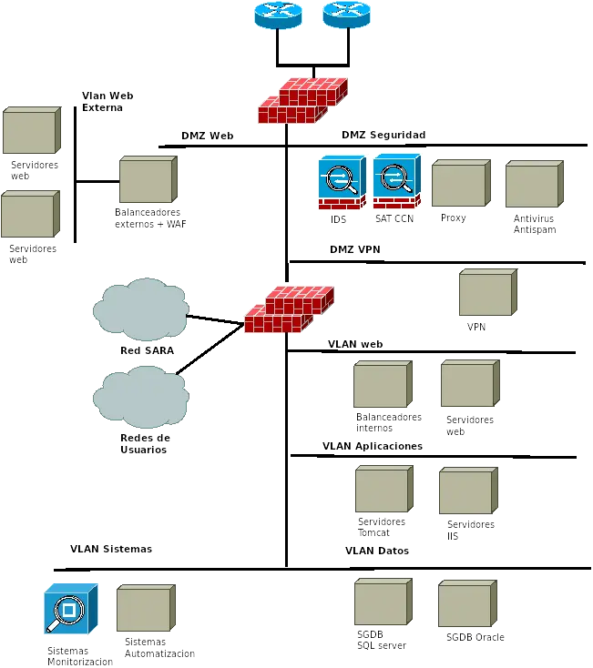
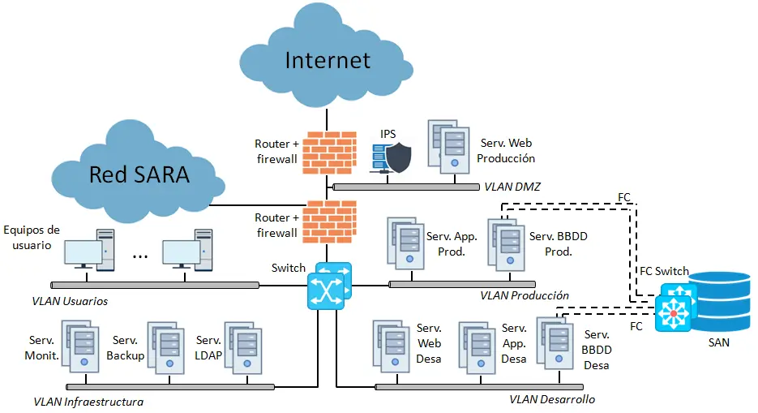

> [!NOTE]
> Ejemplo 1. Diagrama de Red con Nube SARA

> [!NOTE]
> Ejemplo 2. Diagrama de Red

## Explicación del diagrama 2 <!-- {docsify-ignore} -->

La infraestructura seguirá un esquema de varias líneas de defensa, dos niveles de cortafuegos de diferentes fabricantes configurados en activo-pasivo, como se puede ver en la siguiente figura:

Los routers de salida a internet deberán hablar **eBGP** con los routers del operador e **iBGP** entre ellos. Como protocolo de enrutamiento interno deberán soportar **OSPF**.  
Los cortafuegos externos se configurarán con **VRRP**, soportarán **OSPF** y filtrarán los accesos de internet a los servicios publicados en la **DMZ**.

### Existirá una DMZ de seguridad en la que habrá: <!-- {docsify-ignore} -->

- **IDS**: Sistema de detección de intrusiones que monitorizará el tráfico hacia Internet y el tráfico filtrado del Firewall desde Internet. Mediante la aplicación de reglas, enviará alertas en caso de que se produzca alguna incidencia. Se puede utilizar software libre como **SNORT**.
- **Sistema de alerta temprana (SAT)** del CCN.
- **Proxy**: Filtrará la navegación web del interior de la organización. Como opción de software libre se utilizará **SQUID**.
- **Antivirus y AntiSpam**: Analizará los correos entrantes a la organización y aplicará reglas antispam.

### Existirá una DMZ de servicios web donde se colocarán: <!-- {docsify-ignore} -->

- **Balanceadores de carga** con direccionamiento público que proporcionarán servicios y páginas web al exterior de la organización. Los balanceadores externos deberán incorporar un **WAF** integrado.
- Detrás de la DMZ de servicios se colocará una **VLAN Web Externa** con los servidores web **IIS (Microsoft)** de la Extranet, al ser una aplicación .NET. Los servidores tendrán direccionamiento privado, ya que desde Internet se accede únicamente al balanceador.

### Existirá una DMZ de servicios VPN donde se colocarán: <!-- {docsify-ignore} -->

- **Servidores VPN** para proporcionar acceso seguro mediante túneles **SSL/TLS** a la Extranet por parte de proveedores y acceso a la red interna para los trabajadores.

El cortafuegos interno filtrará los accesos desde la DMZ hacia el interior de la organización. Se configurarán en **activo-pasivo** con **VRRP** y soportarán **OSPF**. En este nivel de cortafuegos se conectarán la red **SARA**, las redes de los servicios **CPD** y los usuarios.

### Redes internas y VLANs: <!-- {docsify-ignore} -->

- Se creará una **VLAN web** para los servicios web y aplicaciones. En esta VLAN se colocarán los servidores web de la Intranet y las aplicaciones internas.  
  - Para la Intranet se utilizarán servidores **IIS (Microsoft)**.
  - Para las aplicaciones internas se utilizarán servidores **Apache**, dado que se tratan de aplicaciones desarrolladas en **Java**.

- Se creará una **VLAN de aplicaciones** donde se instalarán los distintos servidores de aplicaciones.  
  - Para las aplicaciones desarrolladas en Java se podrá utilizar **Apache Tomcat** si no utilizan **Enterprise JavaBeans (EJB)**.

- En la **VLAN de datos** se configurarán los distintos servidores de bases de datos de la organización.

- Existirá una **VLAN de sistemas** en la que se configurarán los sistemas de monitorización, máquinas de salto para la gestión de los equipos y la plataforma de automatización.

### Automatización de la infraestructura: <!-- {docsify-ignore} -->

Para la automatización de la infraestructura existen diferentes opciones de software libre como **Chef** y **Puppet**. Sin embargo, se sugiere **Ansible** debido a que, además de ser software libre, no necesita instalar agentes en los nodos gestionados.

Como orquestador de la plataforma de automatización se podrá utilizar **Jenkins**, que hará uso del plugin para **Ansible** en lugar de utilizar la aplicación **Ansible Tower**, propietaria de Red Hat.

> [!NOTE]
> Ejemplo 3. Diagrama de Red

## Explicación del diagrama 3 <!-- {docsify-ignore} -->

Segmentamos la red dividiéndola en cinco redes virtuales para aumentar el nivel de seguridad: **VLAN de Producción**, **VLAN de Desarrollo**, **VLAN de Infraestructura**, **VLAN de Usuarios** y **VLAN de la DMZ**. Agrupamos los equipos de manera lógica según estas categorías, como se indica en el diagrama. Para ello, instalamos un **switch** en la red interna que interconecta las cuatro primeras subredes, y lo redundamos para que el servicio siga operativo en caso de fallo. Posteriormente, implementamos las **ACLs** necesarias para permitir solo las conexiones entre las máquinas establecidas, prohibiendo las conexiones entre equipos de entornos cruzados y aquellas entre equipos de usuario y servidores.

Implementamos una solución de **virtualización** que permite ejecutar varias máquinas virtuales sobre las máquinas físicas disponibles (7 servidores), con el objetivo de compartir recursos y ampliar el número de equipos. Aunque esto implica una ligera penalización en el rendimiento, es asumible dado que no es un factor crítico para el proyecto. En este contexto, virtualizamos todos los servidores, incluidos los de bases de datos, dado que el servicio es ligero (como puede ser **MySQL**). Si fuera un servicio con mayores requisitos de rendimiento, como **Oracle**, preferiríamos mantenerlo en máquinas físicas. Organizamos cada servidor físico para albergar las máquinas de cada VLAN, manteniendo otros tres servidores libres para futuros agregados en caso de saturación.

La distribución que seleccionamos es la siguiente:
- Una máquina para los dos servidores web de **Producción** y el **IDS**.
- Una máquina para los dos servidores de **monitorización**, los dos servidores de **backup** y los dos servidores de **LDAP**.
- Una máquina para los dos servidores web, los dos de aplicaciones y los dos de bases de datos de **Desarrollo**.
- Una máquina para los dos servidores de aplicaciones y los dos de bases de datos de **Producción**.

Duplicamos todas las máquinas existentes (ahora virtuales) para disponer de un **cluster Activo-Pasivo** para cada servicio y entorno, garantizando así alta disponibilidad y tolerancia a fallos. En caso de incidencias, como el consumo excesivo de memoria en un servidor de aplicaciones, el servicio se balancea automáticamente al segundo nodo, manteniendo el funcionamiento normal. Definimos una **IP virtual** que balancea entre las IPs de los dos nodos del clúster, dependiendo de cuál esté activo. Los servidores de aplicaciones se configuran en modo **Activo-Activo**, permitiendo que las peticiones del servidor web se balanceen entre ambos, aumentando el rendimiento. Para los servidores web de **Producción**, añadimos un **balanceador** que reparte las peticiones de los usuarios a ambos nodos, implementando un esquema **Activo-Activo** que mejora el rendimiento.

Instalamos nuevos **routers** como respaldo de los actuales y los configuramos con el protocolo **VRRP**, tal como se mencionó anteriormente. La mejor opción es que la pareja de routers externos sea de un fabricante distinto a los internos.

Colocamos un **equipo IPS** en la **DMZ** para detectar y prevenir accesos malintencionados al sistema, analizando todo el tráfico entrante y ayudando a reaccionar rápidamente ante incidencias.

Desplegamos dos nuevos **servidores virtuales** en la **VLAN de Infraestructura**, uno para la **monitorización de la red** y otro para las **copias de seguridad**, ambos con las características definidas previamente y duplicados para garantizar alta disponibilidad.

Nos conectamos a la red **SARA** a través del Ministerio del que depende la **AESC**, que actúa como **PAS** (Proveedor de Acceso a SARA), cumpliendo con la **Norma Técnica de Interoperabilidad de Requisitos de conexión** a la Red de Comunicaciones de las Administraciones Públicas Españolas. Esto nos permite recibir conexiones de las Comunidades Autónomas que quieran utilizar la aplicación, así como acceder a todos los servicios comunes necesarios. Utilizamos el **router interno de la DMZ** para establecer la conexión con el Ministerio.

Instalamos dos **switches de fibra** para realizar la conexión a la **SAN** a través de ellos. Cada servidor tiene cuatro caminos hacia estos switches (dos puertos **FC** por cada **HBA**, y dos **HBAs** por servidor), y cada switch tiene cuatro caminos hacia las cabinas de discos, lo que proporciona protección contra fallos de caminos. Implementamos **WWN Zoning** para garantizar la seguridad de la red SAN, permitiendo únicamente los accesos autorizados a los distintos bloques de datos.

