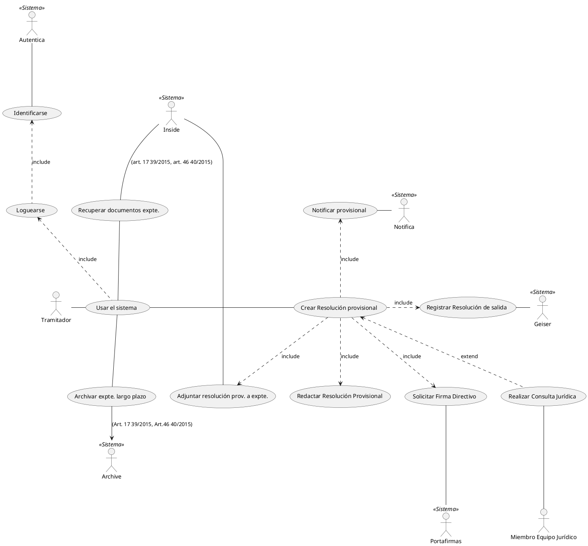

## Ejemplo 1 de Diagrama de Casos de Uso

```plantuml
@startuml
actor "Tramitador" as tr
Archive <<Sistema>> as arch
actor "Miembro Equipo Jurídico" as mj
Portafirmas <<Sistema>> as porta
Geiser <<Sistema>> as gs
Notifica <<Sistema>> as not
Inside <<Sistema>> as insi
Autentica <<Sistema>> as aut

:tr: -right-- (Usar el sistema)
(Usar el sistema) -down-- (Archivar expte. largo plazo)
(Archivar expte. largo plazo) -down-> arch: (Art. 17 39/2015, Art.46 40/2015)
(Usar el sistema) -right-- (Crear Resolución provisional)
(Crear Resolución provisional) -down..>(Solicitar Firma Directivo) : include
(Solicitar Firma Directivo) -down-- porta
(Crear Resolución provisional) <..down-(Realizar Consulta Jurídica) : extend
(Realizar Consulta Jurídica) -down-- mj
(Crear Resolución provisional) -down..>(Redactar Resolución Provisional) : include
(Crear Resolución provisional) -down..>(Adjuntar resolución prov. a expte.) : include
(Adjuntar resolución prov. a expte.) -up-- insi
(Crear Resolución provisional) -right..>(Registrar Resolución de salida) : include
(Registrar Resolución de salida) -right-- gs
(Crear Resolución provisional) -up..> (Notificar provisional) : include
(Notificar provisional) -right-- not
(Usar el sistema) -up-- (Recuperar documentos expte.)
(Recuperar documentos expte.) -up-- insi: (art. 17 39/2015, art. 46 40/2015)
(Usar el sistema) -up..> (Loguearse) : include
(Loguearse) -up..> (Identificarse) : include
(Identificarse) -up-- aut

@enduml
```