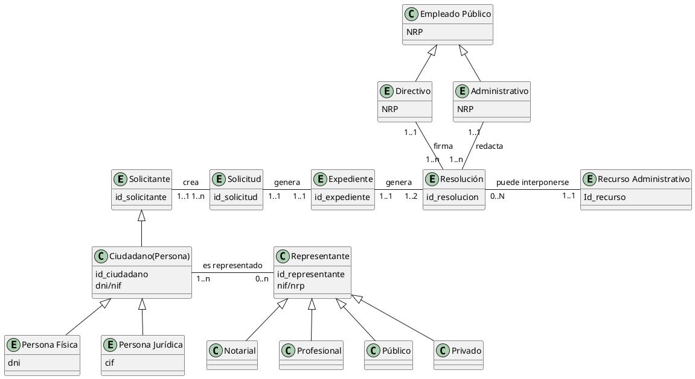

## Ejemplo 1 de Diagrama de Clases <!-- {docsify-ignore} -->

```plantuml
@startuml

entity "Solicitante" as solicitante {
    id_solicitante
}
class "Ciudadano(Persona)" as ciudadano {
    id_ciudadano
    dni/nif
}
class "Representante" as representante{
    id_representante
    nif/nrp
}
entity "Persona Física" as pfisica {
    dni
}
entity "Persona Jurídica" as pjuridica {
    cif
}
entity "Solicitud" as solicitud {
    id_solicitud
}
entity "Expediente" as expte {
    id_expediente
}
entity "Resolución" as resol {
    id_resolucion
}
entity "Administrativo" as admtivo{
    NRP
}
entity "Directivo" as directivo{
    NRP
}
entity "Recurso Administrativo" as recurso {
    Id_recurso
}
class "Empleado Público" as epublico {
    NRP
}

solicitante <|--ciudadano
ciudadano "1..n" - "0..n" representante: "es representado"
ciudadano <|--pfisica
ciudadano <|--pjuridica
representante <|--Notarial
representante <|--Profesional
representante <|--Público
representante <|--Privado

solicitante "1..1" - "1..n" solicitud: crea
solicitud "1..1" - "1..1" expte: genera
expte "1..1" - "1..2" resol: genera

resol "1..n" -up- "1..1" admtivo: redacta
resol "1..n" -up- "1..1" directivo: firma
directivo -up-|> epublico
admtivo -up-|> epublico
resol "0..N" -right- "1..1" recurso: "puede interponerse"

@enduml
```
