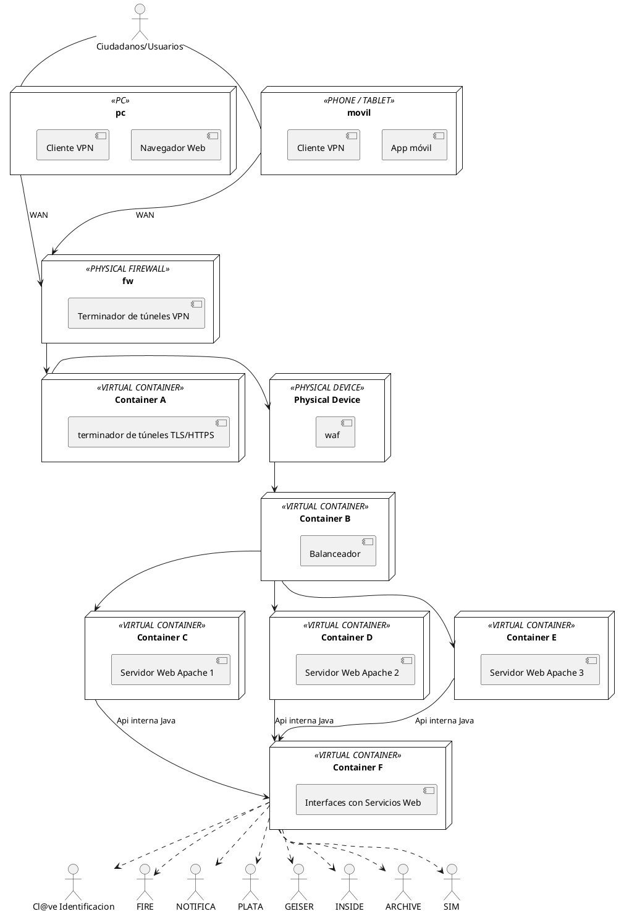

## Ejemplo 1 de Diagrama de Despliegue <!-- {docsify-ignore} -->

```plantuml
@startuml
actor "Ciudadanos/Usuarios" as ciudadano

ciudadano -down- pc
ciudadano -down- movil
pc -down--> fw: WAN
movil -down--> fw: WAN
fw -->"Container A"
"Container A" -right->"Physical Device"
"Physical Device" -->"Container B"
"Container B" -->"Container C"
"Container B" -->"Container D"
"Container B" -->"Container E"
"Container C" -->"Container F" : "Api interna Java"
"Container D" -->"Container F" : "Api interna Java"
"Container E" -->"Container F" : "Api interna Java"


node "PC" as pc <<PC>> {
    component "Navegador Web" as browser
    component "Cliente VPN" as clientevpn_pc
}
node "móvil" as movil <<PHONE / TABLET>> {
    component "App móvil" as app
    component "Cliente VPN" as clientevpn_movil
}
node "Firewall" as fw <<PHYSICAL FIREWALL>> {
    component "Terminador de túneles VPN" as terminador
}
node "Container A" <<VIRTUAL CONTAINER>> {
    component "terminador de túneles TLS/HTTPS"
}
node "Physical Device" <<PHYSICAL DEVICE>>  {
    component "waf"
}
node "Container B" <<VIRTUAL CONTAINER>> {
    component "Balanceador"
}
node "Container C" <<VIRTUAL CONTAINER>> {
    component "Servidor Web Apache 1"
}
node "Container D" <<VIRTUAL CONTAINER>> {
    component "Servidor Web Apache 2"
}
node "Container E" <<VIRTUAL CONTAINER>> {
    component "Servidor Web Apache 3"
}
node "Container F" <<VIRTUAL CONTAINER>> {
    component "Interfaces con Servicios Web"
}
"Container F" ..> "Cl@ve Identificacion"
"Container F" ..> "FIRE"
"Container F" ..> "NOTIFICA"
"Container F" ..> "PLATA"
"Container F" ..> "GEISER"
"Container F" ..> "INSIDE"
"Container F" ..> "ARCHIVE"
"Container F" ..> "SIM"

@enduml
```