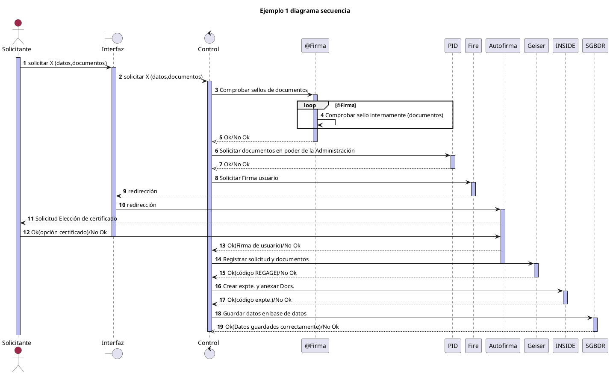

## Ejemplo 1 de diagrama de secuencia <!-- {docsify-ignore} -->

```plantuml
@startuml
    autonumber
    title Ejemplo 1 diagrama secuencia
    actor Solicitante #9e284c
    boundary Interfaz 
    control Control
    activate Solicitante #BBBEEC
    Solicitante->Interfaz: solicitar X (datos,documentos)
    activate Interfaz #BBBEEC
    Interfaz->Control: solicitar X (datos,documentos)
    activate Control #BBBEEC
    Control->@Firma: Comprobar sellos de documentos
        activate @Firma #BBBEEC
    loop @Firma
        @Firma->@Firma: Comprobar sello internamente (documentos)
    end
    @Firma-->>Control: Ok/No Ok
    deactivate @Firma
    Control->PID: Solicitar documentos en poder de la Administración
    activate PID #BBBEEC
    PID-->>Control: Ok/No Ok
    deactivate PID
    Control->Fire: Solicitar Firma usuario
    activate Fire #BBBEEC
    Fire-->Interfaz: redirección
    deactivate Fire
    Interfaz->Autofirma: redirección
    activate Autofirma #BBBEEC 
    Autofirma-->Solicitante: Solicitud Elección de certificado
    Solicitante->Autofirma: Ok(opción certificado)/No Ok
    deactivate Interfaz
    Autofirma-->Control: Ok(Firma de usuario)/No Ok
    Control->Geiser: Registrar solicitud y documentos
    deactivate Autofirma
    activate Geiser #BBBEEC
    Geiser-->Control: Ok(código REGAGE)/No Ok
    deactivate Geiser
    Control->INSIDE: Crear expte. y anexar Docs.
    activate INSIDE #BBBEEC
    INSIDE-->Control: Ok(código expte.)/No Ok
    deactivate INSIDE
    Control->SGBDR: Guardar datos en base de datos
    activate SGBDR #BBBEEC
    SGBDR-->>Control: Ok(Datos guardados correctamente)/No Ok
    deactivate SGBDR
    deactivate Control
@enduml
```
