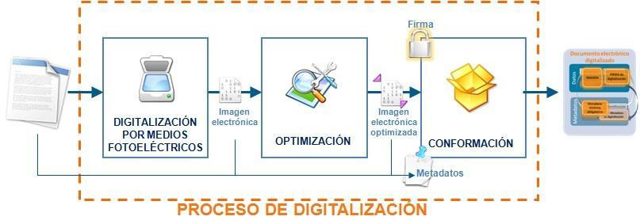

> [!TIP|style: callout|icon: fa fa-check|label: Contenido Verificado]
> Contenido extraído de la documentación de [Preparatic 30](https://www.preparatic.org/material-preparatic-30/).

## NTI de Digitalización de Documentos: Normativa y Requisitos <!-- {docsify-ignore} -->

La Norma Técnica de Interoperabilidad (NTI) de Digitalización de Documentos, aprobada el 19 de julio de 2011 por la Secretaría de Estado para la Función Pública, establece un marco normativo para la digitalización de documentos en soporte papel u otros soportes no electrónicos. Esta normativa es fundamental para garantizar la integridad, autenticidad y accesibilidad de los documentos en su formato digital.

### Objetivo de la NTI <!-- {docsify-ignore} -->

El principal objetivo de la NTI de Digitalización de Documentos es definir los requisitos que deben cumplirse durante el proceso de digitalización. Esta normativa busca asegurar que los documentos físicos o no electrónicos se conviertan en archivos digitales que reflejen fielmente su contenido, manteniendo su integridad y valor probatorio.

### Ámbito de Aplicación <!-- {docsify-ignore} -->

El ámbito de aplicación de la NTI se enmarca dentro del artículo 3 del Real Decreto 4/2010, de 8 de enero, que regula el Esquema Nacional de Interoperabilidad en el ámbito de la Administración Electrónica. Esta norma se aplica a:

- Documentos en soporte papel que se digitalizan.
- Cualquier otro soporte no electrónico que sea susceptible de ser digitalizado a través de medios fotoeléctricos.

### Documentos Electrónicos Digitalizados <!-- {docsify-ignore} -->

#### Definición de Digitalización

Según la definición de la Estrategia Nacional de Interoperabilidad (ENI), la digitalización es el proceso tecnológico que permite convertir un documento en soporte papel o en otro soporte no electrónico en uno o varios ficheros electrónicos que contienen una imagen codificada, fiel e íntegra del documento.

#### Composición de un Documento Electrónico Digitalizado <!-- {docsify-ignore} -->

Un documento electrónico digitalizado estará compuesto por:

1. **Imagen Electrónica**: Representación digital del documento original.
2. **Metadatos Mínimos Obligatorios**: Definidos en la NTI de Documentos Electrónicos, incluyendo el metadato “Estado de elaboración” que deberá indicar “Copia electrónica auténtica con cambio de formato”.
3. **Metadatos Complementarios**: Estos se asignarán para satisfacer necesidades de descripción específicas del proceso de digitalización, conforme a la NTI de Política de Gestión de Documentos Electrónicos.
4. **Firma de la Imagen Electrónica**: Si es necesario, la imagen electrónica podrá llevar una firma, que puede ser un Sello Electrónico de Administración Pública (AP) o un Código Seguro de Verificación (CSV) vinculado a la AP.

#### Metadatos Complementarios

Los metadatos complementarios son aquellos datos adicionales que se asignan a un documento digitalizado para mejorar su gestión y descripción. Deben cumplir los requisitos establecidos en la NTI de Procedimientos de Copiado Auténtico y de Conversión entre Documentos Electrónicos. Algunos ejemplos de metadatos complementarios pueden incluir:

- **Fecha de digitalización**: Fecha en que se realizó la digitalización del documento.
- **Origen del documento**: Información sobre la procedencia del documento original.
- **Autor del documento**: Nombre o identificación del autor del documento original.
- **Palabras clave**: Términos que faciliten la búsqueda y clasificación del documento.
- **Descripción del contenido**: Un breve resumen del contenido del documento digitalizado.
- **Tipo de documento**: Clasificación del tipo de documento (por ejemplo, informe, acta, contrato).

### Requisitos de la Imagen Electrónica <!-- {docsify-ignore} -->

Para garantizar la calidad de las imágenes electrónicas, se establecen los siguientes requisitos:

- **Formatos de Imagen**: Las imágenes electrónicas deben ajustarse a los formatos establecidos para ficheros de imagen en la Norma Técnica de Interoperabilidad de Catálogo de Estándares.
- **Resolución**: El nivel de resolución mínimo para imágenes electrónicas será de 200 píxeles por pulgada, aplicable a imágenes en blanco y negro, color o escala de grises.
- **Fidelidad a Documento Original**: La imagen electrónica debe ser fiel al documento origen, respetando la geometría, tamaños y proporciones. No debe contener caracteres o gráficos que no figuren en el documento original.

### Proceso de Digitalización <!-- {docsify-ignore} -->

La digitalización de un documento se realiza a través de un proceso informático, garantizando la integridad en cada uno de los pasos, que incluye:

1. **Digitalización por un Medio Fotoeléctrico**: Se obtiene una imagen electrónica que se almacena en la memoria del sistema asociado al dispositivo.
2. **Optimización Automática**: Si es necesario, se optimiza la imagen electrónica para garantizar su legibilidad, lo que puede incluir umbralización, reorientación y eliminación de bordes negros.
3. **Asignación de Metadatos**: Se deben asignar metadatos al documento electrónico digitalizado.
4. **Firma de la Imagen Electrónica**: Si es pertinente, se añade la firma de la imagen electrónica.

Además, se deben implementar operaciones de mantenimiento preventivo y comprobaciones rutinarias que aseguren que el estado de la aplicación de digitalización y los dispositivos asociados producen imágenes fieles al documento en soporte papel.