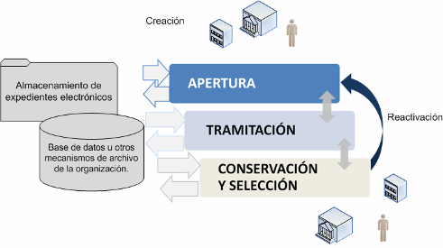

> [!TIP|style: callout|icon: fa fa-check|label: Contenido Verificado]
> Contenido extraído de la documentación de [Preparatic 30](https://www.preparatic.org/material-preparatic-30/).

## NTI de Expediente Electrónico: Estructura y Requisitos <!-- {docsify-ignore} -->

La Norma Técnica de Interoperabilidad (NTI) de Expediente Electrónico, aprobada el 19 de julio de 2011 por la Secretaría de Estado para la Función Pública, establece las bases necesarias para la creación, gestión y intercambio de expedientes electrónicos en el ámbito de la administración pública. Esta normativa es fundamental para garantizar la interoperabilidad y la eficiencia en los procedimientos administrativos.

### Objeto de la NTI <!-- {docsify-ignore} -->

El objetivo principal de la NTI de Expediente Electrónico es definir la estructura y el formato de los expedientes electrónicos, así como especificar los servicios relacionados con su remisión y puesta a disposición. Esta normativa busca asegurar que los expedientes electrónicos sean manejados de manera uniforme y estandarizada en toda la administración pública.

### Ámbito de Aplicación <!-- {docsify-ignore} -->

El ámbito de aplicación de esta norma se establece en el artículo 3 del Real Decreto 4/2010, de 8 de enero, que regula el Esquema Nacional de Interoperabilidad en el contexto de la Administración Electrónica. Esto significa que se aplica a todos los procedimientos y documentos que forman parte del funcionamiento administrativo en formato electrónico.

#### Definición de Expediente Administrativo

Según el artículo 70 de la Ley 39/2015, de 1 de octubre, el expediente administrativo se define como un “conjunto ordenado de documentos y actuaciones que sirven de antecedente y fundamento a la resolución administrativa, así como las diligencias encaminadas a ejecutarla”. La ley establece claramente que “los expedientes tendrán formato electrónico”, lo que resalta la importancia de la digitalización en la administración pública.

### Componentes del Expediente Electrónico <!-- {docsify-ignore} -->

El expediente electrónico se compone de varios elementos clave:

1. **Documentos Electrónicos**: 
   - Los documentos que integran el expediente deberán cumplir con las características de estructura y formato establecidas en la NTI de Documento Electrónico. 
   - Estos documentos pueden incluirse en el expediente de diversas maneras:
     - Como elementos independientes.
     - Dentro de una carpeta, que es una agrupación de documentos electrónicos creada por motivos funcionales.
     - Como parte de otro expediente, lo que se conoce como “anidación”.

2. **Índice Electrónico**: 
   - Este índice garantizará la integridad del expediente electrónico y permitirá su recuperación en cualquier momento. 
   - Recogerá el conjunto de documentos electrónicos asociados al expediente en un momento dado, incluyendo su disposición en carpetas o expedientes.

3. **Firma del Índice Electrónico**: 
   - El índice electrónico deberá ser firmado por la Administración, órgano o entidad actuante, conforme a la normativa aplicable.

4. **Metadatos del Expediente Electrónico**: 
   - Los metadatos son esenciales para la gestión y organización del expediente, proporcionando información adicional que facilita su uso y recuperación.

### Intercambio de Expedientes Electrónicos <!-- {docsify-ignore} -->

El intercambio de expedientes electrónicos se realizará bajo las siguientes directrices:

- **Estructura de Envío**: 
  - La remisión y puesta a disposición de los expedientes se llevarán a cabo siguiendo la estructura definida en la NTI, sin perjuicio de otras normas específicas. 
  - Cada uno de los documentos electrónicos del expediente se enviará en el orden indicado en el índice.

- **Estructuras Excepcionales**: 
  - En casos excepcionales, se podrán aplicar otras estructuras para el intercambio entre Administraciones Públicas, siempre que haya un acuerdo previo entre las partes. 
  - Si es necesario enviar documentos a un tercero, la estructura utilizada será convertida por el emisor a la definida en la NTI.

- **Documentación Específica**: 
  - Cuando la naturaleza o extensión de las pruebas o documentos del expediente electrónico dificulten su inclusión en una de las estructuras establecidas, se deberá incorporar un documento que especifique las características de estas pruebas.

- **Índice Mínimo**: 
  - El índice mínimo contendrá, de acuerdo con la NTI de Catálogo de Estándares, información como la fecha de incorporación y el orden, que son opcionales. 

- **Transmisión Preferente**: 
  - Para la transmisión de los expedientes, se utilizará preferentemente la red SARA, que garantiza un intercambio seguro y eficiente.

- **Asientos Registrales**: 
  - Si el expediente forma parte de un asiento registral, se tratará como un adjunto del mensaje de datos, conforme a la NTI de Modelo de Datos para el intercambio de asientos entre entidades registrales.

### Ciclo de Vida de un Expediente <!-- {docsify-ignore} -->

El ciclo de vida de un expediente electrónico abarca desde su creación, gestión, hasta su cierre y archivo. Cada una de estas fases es crucial para asegurar la integridad y disponibilidad de la información a lo largo del tiempo. 

