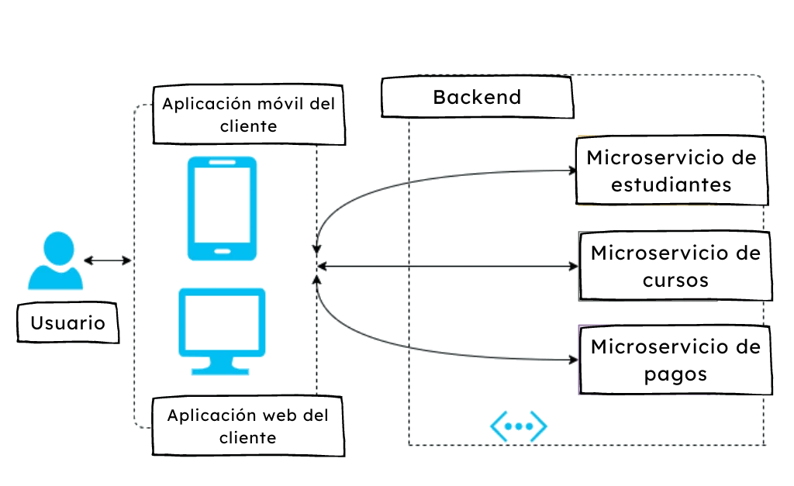
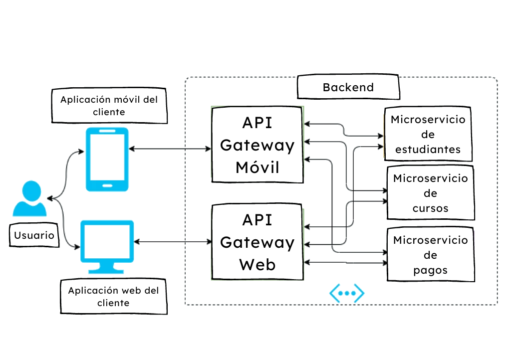
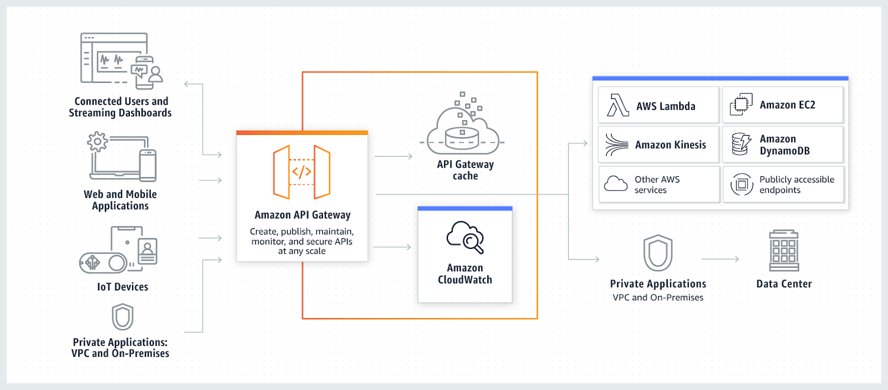
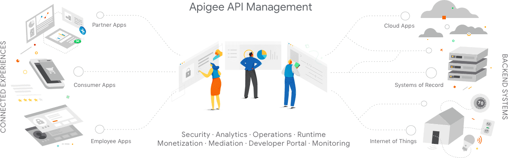
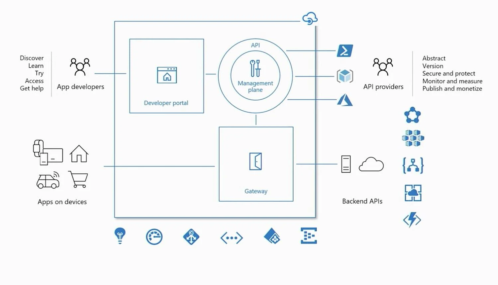
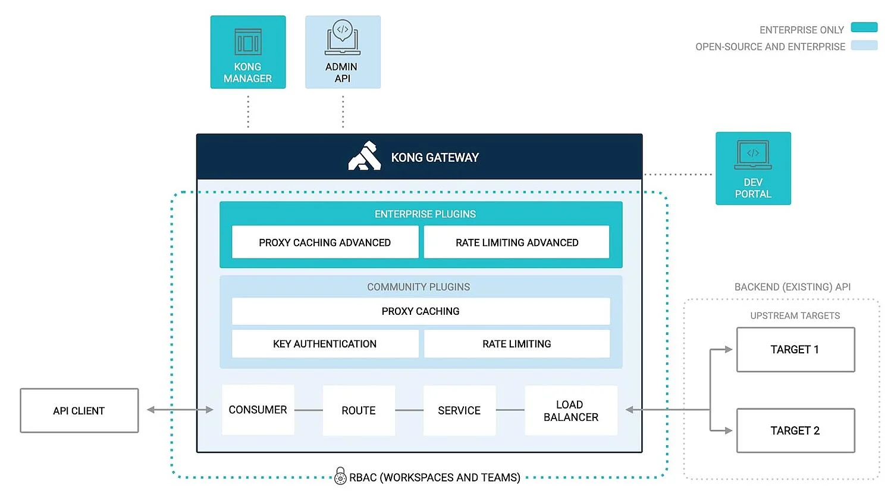

## Qué es una API Gateway, cómo funciona y las mejores opciones <!-- {docsify-ignore} -->

Las interfaces de programación de aplicaciones (API, por sus siglas en inglés) son herramientas fundamentales que permiten a los desarrolladores acceder a los servicios de otras empresas, software, datos o fragmentos de código, lo que amplía la funcionalidad de sus productos y, al mismo tiempo, ahorra tiempo y dinero. A medida que más empresas utilizan APIs de terceros o desarrollan las suyas para ofrecer a otros, se hace evidente que la creación y gestión de estas APIs no es una tarea sencilla. Para facilitar este proceso, se utilizan **API Gateways**.

En este artículo, exploraremos en profundidad qué es una API Gateway, cómo funciona, sus ventajas y las mejores opciones disponibles en el mercado.

### ¿Qué es una API Gateway? <!-- {docsify-ignore} -->

Una **API Gateway** actúa como un gestor que recibe todas las solicitudes API y actúa como un proxy inverso, recuperando recursos de las aplicaciones de back-end en nombre de la aplicación del cliente. Esta herramienta maneja diversas tareas relacionadas con los servicios de API, como la autenticación de usuarios, la limitación de velocidad y el monitoreo del uso.

Para entender mejor el concepto, podemos usar una analogía: imagina una API Gateway como una puerta. Detrás de esta puerta se encuentran los servicios de back-end a los que las aplicaciones del cliente desean acceder. Cuando el cliente, conocido como consumidor de API, realiza una solicitud, primero verifica su identidad y luego espera recibir los datos solicitados. Mientras tanto, su solicitud se enruta al sistema API correspondiente y la respuesta se envía de regreso al cliente.

### ¿Cómo funciona una API Gateway? <!-- {docsify-ignore} -->

Una API Gateway desacopla la interfaz del cliente de la implementación de back-end en un entorno de aplicaciones, como una arquitectura de microservicios. Cuando un consumidor de API envía una solicitud, esta atraviesa tres fases:

1. **Flujo de solicitud**: La solicitud se autoriza, valida y transforma para que coincida con un punto final en el back-end. Aquí, el proveedor de la API puede requerir un encabezado HTTP, una cadena de consulta o una clave de API específica para identificar a la persona que llama. Se rechazan las solicitudes no autorizadas o se aplican límites de cuota.

2. **Enrutamiento de servicio**: En esta fase, la solicitud se dirige al servicio o servicios relevantes. Por ejemplo, en Amazon API Gateway, la solicitud puede ser enviada a una función en AWS Lambda u otro recurso de AWS. Aquí es donde se ejecuta la acción solicitada, como guardar un registro en una base de datos.

3. **Flujo de respuesta**: Finalmente, la respuesta se transforma y se envía de regreso al cliente. Una API Gateway puede enrutar una solicitud a múltiples servicios, consolidando los resultados en una única respuesta, que puede incluir un código de estado HTTP que confirma el éxito de la solicitud.

### ¿Por qué usar una API Gateway? <!-- {docsify-ignore} -->

Las API Gateways ofrecen múltiples beneficios, entre los que se destacan:

- **Manejo de autenticación y limitación de velocidad**: Esto ayuda a evitar el uso abusivo de la API, ya sea accidental o intencional.

- **Monitoreo y análisis**: Permiten realizar un seguimiento del uso de las APIs y los servicios, lo que proporciona información valiosa sobre el rendimiento.

- **Simplificación de la gestión de servicios**: Facilitan la adición o eliminación de servicios API sin afectar la manera en que las aplicaciones del cliente acceden a ellos. Todas las solicitudes se hacen a través de un único punto de entrada, lo que simplifica la arquitectura.

### Microservicios y API Gateway <!-- {docsify-ignore} -->

En la arquitectura moderna, muchas empresas han adoptado **microservicios**, donde múltiples servicios son responsables de diferentes tareas. Las aplicaciones del cliente pueden acceder a estos servicios de dos maneras:

1. **Comunicación directa**: Las aplicaciones envían solicitudes directamente a microservicios individuales, lo que puede generar un mayor número de viajes de ida y vuelta, aumentando la latencia y los riesgos de seguridad.

2. **Uso de una API Gateway**: Proporciona un único punto de entrada. Cuando un cliente envía una solicitud, la Gateway la divide en múltiples solicitudes hacia diferentes servicios de back-end y devuelve la respuesta en un solo viaje, mejorando la velocidad y la experiencia del usuario.

### Tipos de API Gateway: Propietarias vs. Código Abierto <!-- {docsify-ignore} -->

Las API Gateways pueden ser **propietarias** o de **código abierto**. 

- **Propietarias**: Son controladas por un proveedor y generalmente requieren una tarifa de suscripción. Estas opciones suelen incluir soporte administrativo y cumplimiento de normativas.

- **Código Abierto**: Son gratuitas y permiten mayor personalización. Sin embargo, los usuarios deben gestionar la mayoría de las tareas administrativas.

### Proveedores de servicios de API Gateway <!-- {docsify-ignore} -->

A continuación, se presentan algunas de las mejores opciones disponibles en el mercado:

#### 1. Amazon API Gateway

Un servicio completamente administrado que facilita la creación y gestión de APIs a cualquier escala. Permite crear APIs para aplicaciones propias o para terceros, gestionando tráfico, autorización y control de acceso de manera eficiente.

#### 2. Apigee

Una solución escalable y segura de Google, ideal para modernizar sistemas heredados. Permite diseñar, asegurar y monetizar APIs, ofreciendo un "API wrapper" que facilita la interacción con sistemas SAP.

#### 3. Azure API Gateway

Perfecta para entornos híbridos y multicloud, permite administrar todas las APIs desde un único servicio, aplicando políticas de seguridad y recopilando telemetría.

#### 4. Kong

Una API Gateway de código abierto optimizada para microservicios. Ofrece una capa de autenticación y análisis de tráfico, y permite escalar aplicaciones sin importar dónde se ejecuten.

#### 5. Tyk

Otra opción de código abierto, fácil de usar y ampliar. Ofrece un panel de control para gestionar tareas administrativas, aunque carece de funciones integradas de facturación.

### ¿Cómo elegir la API Gateway adecuada? <!-- {docsify-ignore} -->

La elección de una API Gateway adecuada depende de factores como el presupuesto, las necesidades de gestión diaria y la posibilidad de extender su funcionalidad. Evalúa las características que son más importantes para tu empresa y considera tanto las opciones propietarias como las de código abierto para encontrar la mejor solución para tus necesidades.

En resumen, las API Gateways son herramientas esenciales para gestionar y optimizar el acceso a servicios y datos a través de APIs, mejorando la eficiencia y la seguridad en entornos de desarrollo cada vez más complejos.