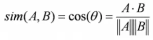
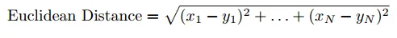
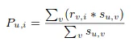
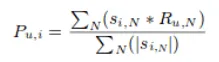
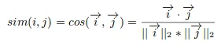

## Sistemas de recomendación <!-- {docsify-ignore} -->

En el mundo de hoy, cada usuario o cliente de las diferentes plataformas online se enfrenta a múltiples opciones. Por ejemplo, si estoy buscando una película para ver sin tener una idea específica de lo que quiero, hay una amplia gama de posibilidades en cómo mi búsqueda podría tener éxito. Es posible que pierda mucho tiempo navegando por Internet y repasando varios sitios con la esperanza de encontrar recomendaciones de diferentes personas con diferentes gustos.

Pero si existiera un sitio o una app que pudiera recomendarme películas basado ​​en lo que he visto anteriormente, eso sería una gran ayuda (Netflix). En lugar de perder el tiempo en varios sitios, ¡solo puedo iniciar sesión y listo! Cientos de películas recomendadas y adaptadas a mi gusto.

Esto es lo que hacen los sistemas de recomendación y su poder está siendo aprovechado por la mayoría de las empresas en estos días. Desde Amazon hasta Netflix, desde Google hasta Spotify, los sistemas de recomendación son una de las aplicaciones más utilizadas de las técnicas de machine learning (aprendizaje automático).

## 1. ¿Qué son los motores de recomendación? <!-- {docsify-ignore} -->

Un sistema de recomendaciones filtra los datos utilizando diferentes algoritmos y recomienda los ítems más relevantes para los usuarios. Primero captura el comportamiento de un cliente en el pasado y, en base a eso, recomienda productos que los usuarios podrían comprar.

Si un usuario completamente nuevo visita un sitio, ese sitio no tendrá un historial pasado de ese usuario. Entonces, ¿cómo hace el sitio para recomendar productos al usuario? Una solución podría ser recomendar los productos más populares, es decir, los productos que tienen alta demanda.

Si podemos recomendar elementos a un cliente en función de sus necesidades e intereses, se creará un impacto positivo en la experiencia del usuario. Por lo tanto, las empresas hoy en día están construyendo sistemas de recomendación inteligentes al estudiar el comportamiento pasado de sus usuarios.

Ahora que tenemos una idea de qué son los sistemas de recomendación, veamos cómo funcionan.

## 2. ¿Cómo funciona un motor de recomendación? <!-- {docsify-ignore} -->

Antes de profundizar en este tema, primero pensemos cómo podemos recomendar elementos a los usuarios:

- Podemos recomendar los ítems más populares entre todos los usuarios.
- Podemos dividir a los usuarios en segmentos en función de sus preferencias y recomendarles ítems en función del segmento al que pertenecen.

Ambos métodos tienen sus inconvenientes. En el primer caso, los elementos más populares serían los mismos para todo usuario. Mientras que en el segundo caso, a medida que aumenta el número de usuarios, también aumentará el número de funciones. Por lo tanto, clasificar a los usuarios en varios segmentos será una tarea muy difícil o que tomará mucho tiempo computacional.

Centrémonos ahora en cómo funciona un motor de recomendaciones siguiendo los siguientes pasos.

### 2.1 Recopilación de datos <!-- {docsify-ignore} -->

Este es el primer paso y el más crucial para construir un sistema de recomendación. Los datos se pueden recopilar de dos maneras: explícita e implícitamente. Los datos explícitos son información que se proporciona intencionalmente, es decir, entrada de los usuarios, como calificaciones de películas. Los datos implícitos son información que no se proporciona intencionalmente, sino que se recopila de flujos de datos disponibles como el historial de búsquedas, clics, historial de pedidos, etc.

### 2.2 Almacenamiento de datos <!-- {docsify-ignore} -->

La cantidad de datos determina qué tan buenas pueden ser las recomendaciones del modelo. Por ejemplo, en un sistema de recomendación de películas, cuantas más calificaciones den los usuarios a las películas, mejores serán las recomendaciones para otros usuarios. El tipo de datos juega un papel importante a la hora de decidir el tipo de almacenamiento que se debe utilizar.

### 2.3 Filtrando los datos <!-- {docsify-ignore} -->

Después de recopilar y almacenar los datos, debemos filtrarlos para extraer la información relevante requerida para hacer las recomendaciones.

#### 2.3.1 Filtrado Basado en Contenido (Content Based Filtering) <!-- {docsify-ignore} -->

Este algoritmo recomienda productos que son similares a los que le han gustado a un usuario en el pasado.

Por ejemplo, si a una persona le ha gustado la película "Indiana Jones", este algoritmo recomendará películas que pertenecen al mismo género. Pero, ¿cómo entiende el algoritmo de qué género elegir y recomendar películas?

Consideremos el ejemplo de Netflix. Guardan toda la información relacionada con cada usuario en forma de vector. Este vector contiene el comportamiento pasado del usuario, es decir, las películas que le gustan o no le gustan al usuario y las calificaciones dadas por ellos. Este vector es conocido como el **vector de perfil (profile vector)**. Toda la información relacionada con las películas se almacena en otro vector llamado **vector del ítem (item vector)**. El vector de ítems contiene los detalles de cada película, como género, reparto, director, duración, etc.

Este algoritmo encuentra el coseno del ángulo entre el vector de perfil y el vector de ítem, es decir, la similitud de coseno. Supongamos que A es el vector de perfil y B es el vector de ítem, entonces la similitud entre ellos se puede calcular como:

Según el valor del coseno, que como sabemos oscila entre -1 y 1, las películas se organizan en orden descendente y uno de los dos enfoques siguientes se utiliza para recomendaciones:

- **Enfoque de Top-n**: donde se recomiendan las mejores n películas.
- **Enfoque de escala de calificación**: donde se establece un umbral y se recomiendan todas las películas por encima de ese umbral.

Otros métodos que se pueden utilizar para calcular la similitud son:

- **Distancia euclidiana**: los elementos similares se encontrarán cerca uno del otro si se trazan en un espacio n-dimensional. Por lo tanto, podemos calcular la distancia entre los elementos y en función de esa distancia, recomendar elementos al usuario. La fórmula para la distancia euclidiana está dada por:

  

- **Correlación de Pearson**: nos dice cuánto se correlacionan dos elementos. Cuanto más alta sea la correlación, más será la similitud. La correlación de Pearson se puede calcular utilizando la siguiente fórmula:

  

Un inconveniente importante de este algoritmo es que se limita a recomendar elementos del mismo tipo. Nunca recomendará productos que el usuario no haya comprado o no le hayan gustado en el pasado. Entonces, si un usuario ha visto o le han gustado películas de terror en el pasado, el sistema recomendará solo películas de terror. Es una forma muy estrecha de construir un motor.

Para mejorar este tipo de sistema, necesitamos un algoritmo que pueda recomendar elementos no solo en función del contenido, sino también del comportamiento de los usuarios.

#### 2.3.2 Filtrado Colaborativo (Collaborative Filtering) <!-- {docsify-ignore} -->

Entendamos esto con un ejemplo. Si a la persona A le gustan 3 películas, digamos *Indiana Jones*, *Rambo* y *Duro de Matar*, y a la persona B le gusta *Indiana Jones*, *Rambo* y *Terminator*, entonces tienen intereses casi similares. Podemos decir con cierta certeza que A debería gustar *Terminator* y B debería gustar *Duro de Matar*.

El algoritmo de filtrado colaborativo utiliza “comportamiento del usuario” para recomendar elementos. Este es uno de los algoritmos más utilizados en la industria, ya que no depende de ninguna información adicional. Existen diferentes tipos de técnicas de filtrado colaborativo, y las veremos en detalle a continuación.

##### Filtrado colaborativo usuario-usuario <!-- {docsify-ignore} -->

Este algoritmo primero encuentra la puntuación de similitud entre los usuarios. Basándose en esta puntuación de similitud, selecciona a los usuarios más similares y recomienda productos que les gustaron o compraron anteriormente.

La predicción Pu,i viene dada por:

Donde:

Pu,i es la predicción de un artículo
Rv,i es la calificación dada por un usuario v a una película i
Su,v es la similitud entre los usuarios.

Ahora, tenemos las calificaciones para los usuarios en vector de perfil y, en base a eso, tenemos que predecir las calificaciones para otros usuarios. Se siguen los siguientes pasos para hacerlo:

1. Para las predicciones necesitamos la similitud entre el usuario u y v. Podemos hacer uso de la correlación de Pearson.
2. Encontramos los artículos calificados por los usuarios y, según las calificaciones, se calcula la correlación entre los usuarios.
3. Las predicciones se pueden calcular utilizando los valores de similitud. Este algoritmo, en primer lugar, calcula la similitud entre cada usuario y luego, basándose en cada similitud, calcula las predicciones. Los usuarios que tienen mayor correlación tienden a ser similares.
4. Sobre la base de estos valores de predicción, se hacen recomendaciones. Entendámoslo con un ejemplo:

Este algoritmo consume mucho tiempo ya que implica calcular la similitud para cada usuario y luego calcular la predicción para cada puntuación de similitud. Una forma de manejar este problema es seleccionar solo unos pocos usuarios (vecinos) en lugar de todos para hacer predicciones, es decir, en lugar de hacer predicciones para todos los valores de similitud, elegimos solo unos pocos valores de similitud. Hay varias formas de seleccionar a los vecinos:

* Seleccione una similitud de umbral y elija todos los usuarios por encima de ese valor
* Seleccionar al azar los usuarios
* Organice a los vecinos en orden descendente de su valor de similitud y elija usuarios de la N superior
* Utilice la agrupación para elegir vecinos

Este algoritmo no es efectivo cuando hay un gran número de usuarios, ya que tomará mucho tiempo calcular la similitud entre todos los pares de usuarios. Esto nos lleva al filtrado colaborativo de elementos (Item-Item collaborative filtering), que es efectivo cuando la cantidad de usuarios es mayor que los elementos recomendados.

## Item-Item collaborative filtering <!-- {docsify-ignore} -->

En este algoritmo, calculamos la similitud entre cada par de elementos. Encontraremos la similitud entre cada par de películas y, en base a eso, recomendaremos películas similares que les gustaron a los usuarios en el pasado. Este algoritmo funciona de manera similar al filtrado colaborativo usuario-usuario con solo un pequeño cambio: en lugar de tomar la suma ponderada de las calificaciones de “usuarios-vecinos”, tomamos la suma ponderada de las calificaciones de “elementos-vecinos”. La predicción está dada por:

Ahora encontraremos la similitud entre elementos.

Como tenemos la similitud entre cada película y las calificaciones, se hacen predicciones y, en base a esas predicciones, se recomiendan películas similares.

### Cold Start (Arranque en frío) <!-- {docsify-ignore} -->

Antes de continuar e implementar estos conceptos en código, hay una pregunta a la que debemos conocer la respuesta: ¿qué pasa si se agrega un nuevo usuario o un nuevo elemento en el conjunto de datos? Esto se llama un **arranque en frío (Cold Start)**. Puede haber dos tipos de arranque en frío:

- **Arranque en frío de visitantes**  
  El inicio en frío del visitante significa que se introduce un nuevo usuario en el conjunto de datos. Como no hay un historial de ese usuario, el sistema no conoce las preferencias de ese usuario. Se vuelve más difícil recomendar productos a ese usuario. Entonces, ¿cómo podemos resolver este problema? Un enfoque básico podría ser aplicar una estrategia basada en la popularidad, es decir, recomendar los productos más populares. Estos pueden ser determinados por lo que ha sido popular recientemente en general o regional. Una vez que sepamos las preferencias del usuario, recomendar productos será más fácil.

- **Arranque en frío de productos**  
  El arranque en frío de productos significa que un nuevo producto se lanza al mercado o se agrega al sistema. La acción del usuario es lo más importante para determinar el valor de cualquier producto. Cuanta más interacción reciba un producto, más fácil será para nuestro sistema recomendar ese producto al usuario correcto. Podemos hacer uso del **filtrado basado en contenido** para resolver este problema. El sistema primero usa el contenido del nuevo producto para recomendaciones y luego, eventualmente, las acciones del usuario sobre ese producto.

