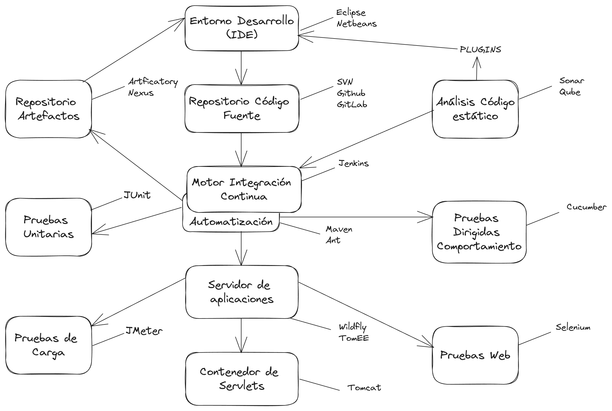

> [!TIP|style: callout|icon: fa fa-check|label: Contenido Verificado]
> Respuesta de ChatGPT sobre el ecosistema JAVA.

## Soluciones tecnológicas del ecosistema Java <!-- {docsify-ignore} -->

| **Categoría**                    | **Solución/Framework**        | **Descripción**                                                                                      |
|-----------------------------------|-------------------------------|------------------------------------------------------------------------------------------------------|
| **Repositorio de Artefactos**     | **Maven Central**             | Repositorio oficial de dependencias y bibliotecas en Java, utilizado por herramientas como Maven y Gradle. |
|                                   | **JFrog Artifactory**         | Repositorio gestionado para artefactos y dependencias, compatible con Maven, Gradle, Docker, etc.        |
| **IDEs**                          | **IntelliJ IDEA**             | IDE altamente popular para el desarrollo de aplicaciones Java, con soporte avanzado para frameworks.     |
|                                   | **Eclipse**                   | IDE de código abierto ampliamente utilizado para el desarrollo en Java y otros lenguajes.               |
|                                   | **NetBeans**                  | IDE de código abierto con soporte para Java, PHP, y otras tecnologías.                                 |
| **Análisis de Código Estático**   | **SonarQube**                 | Herramienta para el análisis de calidad y seguridad del código estático, proporcionando métricas detalladas. |
|                                   | **Checkstyle**                | Herramienta para verificar el cumplimiento de convenciones de estilo de código en proyectos Java.       |
| **Repositorio de Código Fuente**  | **GitHub**                    | Plataforma de alojamiento de código fuente basada en Git, ampliamente usada para control de versiones.  |
|                                   | **GitLab**                    | Plataforma de gestión de repositorios Git con características adicionales como integración continua y DevOps. |
| **Motor de Integración Continua** | **Jenkins**                   | Herramienta de integración continua que automatiza la construcción, pruebas y despliegue de software.   |
|                                   | **GitLab CI/CD**              | Motor de integración continua integrado en GitLab, facilitando el ciclo de vida de desarrollo completo. |
|                                   | **CircleCI**                  | Plataforma de CI/CD que se integra con GitHub y GitLab para automatizar pruebas y despliegues.          |
| **Pruebas Unitarias**             | **JUnit**                     | Framework estándar para escribir y ejecutar pruebas unitarias en Java.                                 |
|                                   | **TestNG**                    | Alternativa a JUnit, diseñada para pruebas unitarias y de integración con características adicionales.  |
| **Pruebas Dirigidas (End-to-End)**| **Selenium**                  | Framework para la automatización de pruebas dirigidas en navegadores web, usado para aplicaciones Java y web. |
|                                   | **Cucumber**                  | Herramienta que permite la automatización de pruebas basadas en comportamiento (BDD) usando lenguaje Gherkin. |
| **Pruebas de Carga**              | **Apache JMeter**             | Herramienta de pruebas de rendimiento y carga para aplicaciones web y servicios basados en Java.        |
|                                   | **Gatling**                   | Herramienta de código abierto para realizar pruebas de carga de aplicaciones web, especialmente optimizada para alto rendimiento. |
| **Pruebas Web**                   | **Selenium WebDriver**        | Framework para automatizar la interacción con navegadores web, compatible con múltiples lenguajes, incluido Java. |
|                                   | **Cypress**                   | Framework para realizar pruebas de front-end en aplicaciones web modernas, también utilizable con Java. |
| **Contenedor de Servlets (Servidor Web)** | **Apache Tomcat**             | Contenedor de servlets y JSP que ejecuta aplicaciones web basadas en Java.                              |
| **Servidor de Aplicaciones**      | **Apache TomEE**              | Servidor de aplicaciones basado en Tomcat, con soporte completo para Jakarta EE (antes Java EE).        |
|                                   | **WildFly (antiguamente JBoss)** | Servidor de aplicaciones completo compatible con Jakarta EE, ideal para aplicaciones empresariales.      |
|                                   | **Payara**                    | Servidor de aplicaciones compatible con Java EE y MicroProfile, basado en GlassFish.                    |
|                                   | **WebLogic**                  | Servidor de aplicaciones empresarial desarrollado por Oracle, con soporte completo para Java EE.        |
|                                   | **WebSphere**                 | Servidor de aplicaciones Java EE desarrollado por IBM, utilizado principalmente en entornos empresariales. |

---
<h3 class="fondo_claro" style="text-align: center;">ECOSISTEMA JAVA</h3>

