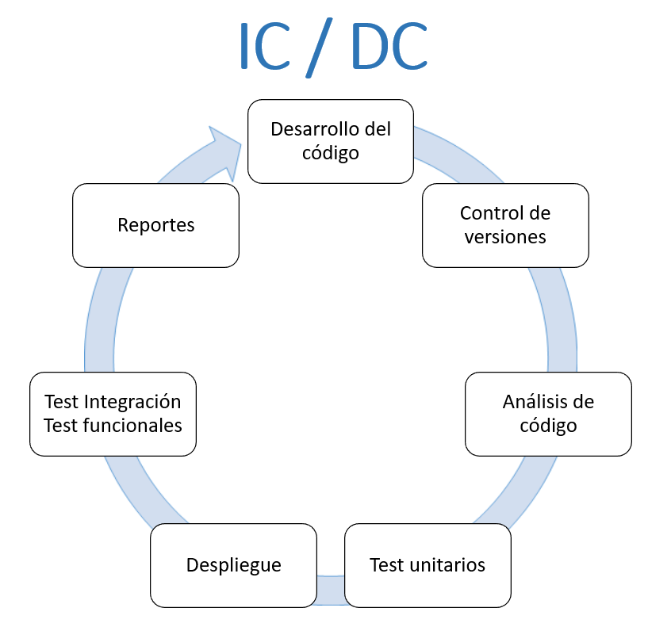

## Integración Continua y Despliegue Continuo: CI/CD <!-- {docsify-ignore} -->

> [!NOTE|style:callout|label:Contenido Verificado]
> Contenido extraído parcialmente de la documentación de [Preparatic 29](https://www.preparatic.org/category/material-pack/material-pack-preparatic-29/).

La integración continua (CI) y el despliegue continuo (CD) son metodologías clave en el desarrollo de software moderno, conocidas en conjunto como CI/CD. Este enfoque permite a los equipos de desarrollo y operaciones automatizar, supervisar y coordinar la entrega de nuevas aplicaciones a clientes. Es una solución eficaz para problemas comunes en la integración de código, facilitando la colaboración y optimizando la entrega de software a través de un canal continuo.

### Integración Continua (CI) <!-- {docsify-ignore} -->

La integración continua es una práctica de automatización para los desarrolladores que les permite integrar y probar frecuentemente los cambios en el código en un repositorio compartido. Esta práctica evita los conflictos de versiones al reducir el número de desarrollos paralelos que pueden crear problemas de sincronización y errores en la etapa de integración. Con CI, los desarrolladores pueden realizar pruebas continuas de los cambios de código, asegurando que cada integración mantiene la estabilidad de la aplicación.

### Despliegue Continuo (CD) <!-- {docsify-ignore} -->

El despliegue continuo, por su parte, amplía la CI al automatizar las pruebas y la implementación de cambios aprobados en un entorno de producción. Aquí, los cambios de código son sometidos a pruebas automáticas para detectar errores y posteriormente cargados en un repositorio de control de versiones (como GitHub) o en un registro de contenedores. Esta práctica permite que los equipos de operaciones implementen los cambios en producción de forma ágil y sin errores, minimizando la intervención manual y los retrasos.

El CD también puede implicar el despliegue automático directo en producción, lo cual facilita la entrega frecuente de nuevas versiones a los usuarios finales, eliminando los procesos manuales que ralentizan la distribución y permitiendo actualizaciones continuas del software.

### Herramientas de CI/CD <!-- {docsify-ignore} -->

Existen diversas herramientas que facilitan la integración y despliegue continuo, cada una especializada en diferentes fases del proceso:

- **Gestión y construcción de proyectos**: Apache Ant, Maven.
- **Control de versiones**: Git, Subversion.
- **Repositorio de artefactos**: Nexus, Artifactory, Archiva.
- **Servidores de CI**: Jenkins, GitLab (con GitLab Runner), Atlassian Bamboo, CircleCI.
- **Análisis y calidad de código**: SonarQube.

Estas herramientas permiten automatizar y organizar las etapas de integración y despliegue, garantizando una entrega rápida y de alta calidad.

### Beneficios de CI/CD <!-- {docsify-ignore} -->

La implementación de CI/CD trae numerosos beneficios al flujo de trabajo de desarrollo y operaciones:

- **Ahorro de tiempo y costos**: Las fases de CI/CD pueden ejecutarse sin intervención humana mediante herramientas de automatización.
- **Feedback rápido**: Cada ciclo genera informes detallados sobre métricas de software, calidad y mejora.
- **Detección temprana de errores**: Se identifican y notifican errores de forma rápida, permitiendo modificaciones con mayores garantías de éxito.
- **Reducción de imprevistos en la entrega**: Evita el caos de último minuto, mejorando la previsibilidad de las entregas.
- **Recuperación rápida ante errores**: En caso de problemas en producción, es fácil revertir a una versión estable anterior.

### Desafíos en la Implementación de CI/CD <!-- {docsify-ignore} -->

A pesar de sus múltiples beneficios, la implementación de CI/CD conlleva ciertos desafíos:

- **Tiempo de preparación y capacitación**: Se requiere tiempo para que los equipos adopten el sistema y comprendan su funcionamiento.
- **Esfuerzo en la creación de pruebas**: Desarrollar una batería de pruebas completa puede ser laborioso; por ello, es importante encontrar un equilibrio entre cobertura y tiempo de desarrollo.

### CI/CD y Métrica v3 <!-- {docsify-ignore} -->

Aunque CI/CD no se menciona explícitamente en Métrica v3, su implementación se puede justificar en ciertas prácticas establecidas por esta metodología de desarrollo tradicional. A continuación, se mencionan los aspectos clave en los que CI/CD se puede integrar en un entorno de Métrica v3.

#### Impacto en la Organización 

El uso de CI/CD puede justificarse bajo Métrica v3, estableciendo la aprobación y coordinación entre los responsables de sistemas, seguridad, servicio e información, según lo define el Esquema Nacional de Seguridad (ENS). Esto asegura que el despliegue de CI/CD cuenta con un marco de seguridad y cumplimiento normativo.

#### Automatización de Pruebas

Métrica v3 define varios tipos de pruebas esenciales (unitarias, de integración, de sistema, de implantación, de aceptación y de regresión), que pueden automatizarse con un sistema CI/CD. Este enfoque permite generar documentación de resultados para el equipo funcional o el propietario del producto (product owner), asegurando una mejora constante en la calidad del código y la conformidad con los requisitos funcionales.

#### Revisión Formal y Técnica

Las prácticas de revisión formal (enfocada en la calidad del producto) y revisión técnica (enfocada en aspectos de accesibilidad) se integran bien en un entorno de CI/CD. Las pruebas automatizadas de calidad y seguridad del código, así como las pruebas de accesibilidad en conformidad con la directiva europea 2019/882, la directiva de accesibilidad en AAPP 2016/2012 y el RD 112/2018, permiten mantener altos estándares de calidad en cada entrega.

En conclusión, CI/CD representa una evolución significativa en la manera en que se desarrollan, prueban e implementan las aplicaciones, permitiendo que los equipos entreguen productos con mayor rapidez y calidad. Su integración con metodologías más tradicionales, como Métrica v3, resulta viable y beneficiosa, asegurando así que cada fase del ciclo de vida del software mantenga un enfoque ágil y eficiente.